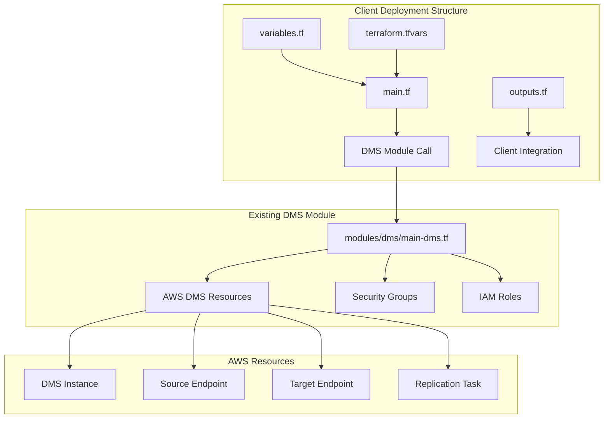

# Design Document

## Overview

This design implements a client-ready AWS DMS deployment structure that follows tech leader recommendations while maintaining the existing module's functionality and flexibility. The solution creates a wrapper layer that simplifies client usage while preserving all advanced features.

## Architecture

### High-Level Architecture



### Deployment Structure

The new structure follows this pattern:
```
project-root/
├── main.tf                    # Module call with inline variables (tech leader pattern)
├── variables.tf               # Client-configurable variables
├── outputs.tf                 # Resource outputs for integration
├── terraform.tfvars           # Environment-specific values
├── README.md                  # Comprehensive documentation
└── modules/dms/               # Existing module (minimal changes)
    ├── main-dms.tf
    ├── variables.tf
    ├── locals.tf
    └── outputs.tf
```

## Components and Interfaces

### Main Terraform File (main.tf)

The main.tf file implements the tech leader pattern by embedding variable values directly in the module call:

```hcl
module "dms" {
  source = "./modules/dms"
  
  # Core Configuration - Direct variable assignment
  project_name = var.project_name
  environment  = var.environment
  
  # Network Configuration
  vpc_id     = var.vpc_id
  subnet_ids = var.subnet_ids
  
  # Endpoint Configuration with flexible credential management
  enable_secrets_manager = var.enable_secrets_manager
  source_endpoint_config = {
    engine_name                     = var.source_database_engine
    secrets_manager_arn             = var.enable_secrets_manager ? var.source_secrets_manager_arn : ""
    secrets_manager_access_role_arn = var.enable_secrets_manager ? var.source_secrets_access_role_arn : ""
    server_name                     = var.enable_secrets_manager ? "" : var.source_database_host
    port                           = var.source_database_port
    username                       = var.enable_secrets_manager ? "" : var.source_database_username
    password                       = var.enable_secrets_manager ? "" : var.source_database_password
    database_name                  = var.source_database_name
    ssl_mode                       = var.source_ssl_mode
    extra_connection_attributes    = var.source_extra_attributes
  }
  
  target_endpoint_config = {
    engine_name                     = var.target_database_engine
    secrets_manager_arn             = var.enable_secrets_manager ? var.target_secrets_manager_arn : ""
    secrets_manager_access_role_arn = var.enable_secrets_manager ? var.target_secrets_access_role_arn : ""
    server_name                     = var.enable_secrets_manager ? "" : var.target_database_host
    port                           = var.target_database_port
    username                       = var.enable_secrets_manager ? "" : var.target_database_username
    password                       = var.enable_secrets_manager ? "" : var.target_database_password
    database_name                  = var.target_database_name
    ssl_mode                       = var.target_ssl_mode
    extra_connection_attributes    = var.target_extra_attributes
  }
  
  # Security Configuration
  source_security_group_id = var.source_security_group_id
  target_security_group_id = var.target_security_group_id
  kms_key_arn             = var.kms_key_arn
  
  # DMS Instance Configuration
  dms_instance_config = {
    instance_class    = var.dms_instance_class
    allocated_storage = var.dms_allocated_storage
    engine_version    = var.dms_engine_version
    multi_az         = var.dms_multi_az
  }
  
  # Migration Configuration
  migration_type           = var.migration_type
  table_mappings          = var.table_mappings
  replication_task_settings = var.replication_task_settings
  
  # Security and Multi-AZ Configuration
  security_config = {
    enforce_ssl                 = var.enforce_ssl
    restrict_public_access      = var.restrict_public_access
    enable_detailed_monitoring  = var.enable_detailed_monitoring
    enable_performance_insights = var.enable_performance_insights
    network_isolation_level     = var.network_isolation_level
    require_kms_encryption      = var.require_kms_encryption
    enable_deletion_protection  = var.enable_deletion_protection
  }
  
  multi_az_config = {
    enable_multi_az              = var.enable_multi_az
    force_multi_az_production    = var.force_multi_az_production
    backup_retention_days        = var.backup_retention_days
    preferred_maintenance_window = var.preferred_maintenance_window
    auto_minor_version_upgrade   = var.auto_minor_version_upgrade
  }
  
  # Tagging
  tags = var.tags
}
```

### Variable Interface (variables.tf)

Client-facing variables organized by category:

```hcl
# Core Project Configuration
variable "project_name" {
  description = "Project name for resource naming and tagging"
  type        = string
}

variable "environment" {
  description = "Environment name (dev, staging, production)"
  type        = string
}

# Network Configuration
variable "vpc_id" {
  description = "VPC ID where DMS resources will be created"
  type        = string
}

variable "subnet_ids" {
  description = "List of subnet IDs for DMS subnet group (minimum 2 for Multi-AZ)"
  type        = list(string)
}

# Database Endpoint Configuration
variable "enable_secrets_manager" {
  description = "Enable AWS Secrets Manager for credential management"
  type        = bool
  default     = true
}

# Source Database Configuration
variable "source_database_engine" {
  description = "Source database engine (mysql, postgres, oracle, etc.)"
  type        = string
}

variable "source_database_host" {
  description = "Source database hostname (required when Secrets Manager disabled)"
  type        = string
  default     = ""
}

# ... additional variables for target database, security, etc.
```

### Output Interface (outputs.tf)

Structured outputs for client integration:

```hcl
output "dms_instance" {
  description = "DMS replication instance details"
  value = {
    arn                    = module.dms.replication_instance_arn
    id                     = module.dms.replication_instance_id
    endpoint               = module.dms.dms_instance.replication_instance_private_ips
    availability_zone      = module.dms.dms_instance.availability_zone
    multi_az              = module.dms.dms_instance.multi_az
  }
}

output "endpoints" {
  description = "DMS endpoint details"
  value = {
    source = {
      arn        = module.dms.source_endpoint_arn
      id         = module.dms.endpoints.source.endpoint_id
      engine     = module.dms.endpoints.source.engine_name
    }
    target = {
      arn        = module.dms.target_endpoint_arn
      id         = module.dms.endpoints.target.endpoint_id
      engine     = module.dms.endpoints.target.engine_name
    }
  }
}

output "replication_task" {
  description = "DMS replication task details"
  value = {
    arn            = module.dms.replication_task_arn
    id             = module.dms.replication_task.replication_task_id
    migration_type = module.dms.replication_task.migration_type
    status         = module.dms.replication_task.status
  }
}
```

## Data Models

### Client Configuration Model

```hcl
# Environment-specific configuration
client_config = {
  project_name = "client-dms-migration"
  environment  = "production"
  
  # Network settings
  vpc_id     = "vpc-client123"
  subnet_ids = ["subnet-private1", "subnet-private2"]
  
  # Database endpoints
  source = {
    engine = "mysql"
    host   = "source-db.client.com"
    port   = 3306
    # credentials via Secrets Manager or direct
  }
  
  target = {
    engine = "aurora-postgresql"
    host   = "target-cluster.client.com"
    port   = 5432
    # credentials via Secrets Manager or direct
  }
  
  # Security settings
  kms_key_arn              = "arn:aws:kms:region:account:key/client-key"
  source_security_group_id = "sg-source123"
  target_security_group_id = "sg-target456"
  
  # DMS configuration
  instance_class = "dms.r5.large"
  multi_az      = true
  
  # Migration settings
  migration_type = "full-load-and-cdc"
}
```

### Module Interface Model

The existing module interface remains unchanged, ensuring backward compatibility:

```hcl
module_interface = {
  # All existing variables maintained
  project_name            = string
  environment            = string
  vpc_id                 = string
  subnet_ids             = list(string)
  source_endpoint_config = object({...})
  target_endpoint_config = object({...})
  # ... all other existing variables
}
```

## Correctness Properties

*A property is a characteristic or behavior that should hold true across all valid executions of a system-essentially, a formal statement about what the system should do. Properties serve as the bridge between human-readable specifications and machine-verifiable correctness guarantees.*

### Property 1: Module Call Consistency
*For any* valid client configuration, the main.tf module call should pass all required variables to the DMS module without data loss or transformation errors
**Validates: Requirements 1.1, 1.2**

### Property 2: Credential Management Flexibility
*For any* credential management choice (Secrets Manager enabled/disabled), the system should correctly configure endpoints with the appropriate authentication method
**Validates: Requirements 2.1, 2.2, 2.3**

### Property 3: Security Group Integration
*For any* provided security group IDs, the system should create proper ingress and egress rules that allow DMS connectivity to source and target databases
**Validates: Requirements 3.1, 3.2, 3.4**

### Property 4: Environment-Specific Configuration
*For any* environment type (dev, staging, production), the system should apply appropriate cost optimization and security settings based on environment classification
**Validates: Requirements 4.1, 4.2, 4.3**

### Property 5: Variable Validation
*For any* invalid input values (malformed ARNs, incorrect formats), the system should reject the configuration with descriptive error messages before resource creation
**Validates: Requirements 7.1, 7.2, 7.3, 7.4**

### Property 6: Reversibility Preservation
*For any* deployment using the new structure, reverting to the original module-only approach should be possible without data loss or configuration corruption
**Validates: Requirements 6.1, 6.2, 6.3**

### Property 7: Hardcoded Value Elimination
*For any* database engine configuration, the system should derive security group ports from endpoint configuration rather than using hardcoded port numbers
**Validates: Requirements 8.1, 8.4**

### Property 8: Professional Code Standards
*For any* documentation or example content, the system should contain only generic, client-appropriate examples without development-specific references
**Validates: Requirements 8.2, 8.3, 8.5**

### Property 9: Output Completeness
*For any* successful deployment, the system should provide all necessary resource identifiers and connection information required for integration
**Validates: Requirements 9.1, 9.2, 9.3, 9.4, 9.5**
*For any* documentation or example content, the system should contain only generic, client-appropriate examples without development-specific references
**Validates: Requirements 8.2, 8.3, 8.5**

### Property 10: Output Completeness
*For any* successful deployment, the system should provide all necessary resource identifiers and connection information required for integration
**Validates: Requirements 9.1, 9.2, 9.3, 9.4, 9.5**

### Property 7: Reversibility Preservation
*For any* deployment using the new structure, reverting to the original module-only approach should be possible without data loss or configuration corruption
**Validates: Requirements 6.1, 6.2, 6.3**

## Error Handling

### Validation Errors
- **Invalid KMS ARN**: Clear message with correct format example
- **Malformed Security Group ID**: Format validation with helpful guidance
- **Missing Required Variables**: Specific indication of what values are needed
- **Incompatible Credential Configuration**: Clear explanation of Secrets Manager vs direct credential requirements

### Runtime Errors
- **Network Connectivity Issues**: Guidance on security group and subnet configuration
- **Permission Errors**: IAM role and policy requirement explanations
- **Resource Conflicts**: Clear identification of conflicting resources and resolution steps

### Recovery Procedures
- **Failed Deployment**: Step-by-step rollback instructions
- **Configuration Changes**: Safe update procedures for existing deployments
- **Environment Migration**: Guidelines for moving between environments

## Testing Strategy

### Unit Testing
- Variable validation logic
- Module call parameter mapping
- Output structure verification
- Error message accuracy

### Integration Testing
- End-to-end deployment in test environment
- Multi-environment configuration testing
- Secrets Manager integration validation
- Security group rule verification

### Property-Based Testing
- Generate random valid configurations and verify successful module calls
- Test credential management switching with various input combinations
- Validate security group rule creation across different network configurations
- Verify environment-specific settings application across all environment types
- Test error handling with systematically invalid inputs
- Validate output completeness across different deployment scenarios
- Test reversibility by deploying and reverting configurations

Each property test should run minimum 100 iterations and be tagged with:
**Feature: dms-module-refactor, Property {number}: {property_text}**