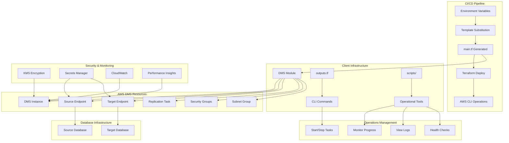

# AWS DMS Deployment - Client-Ready Infrastructure

A production-ready AWS Database Migration Service (DMS) deployment following tech leader approved patterns with comprehensive security, monitoring, and cost optimization features.

## 🚀 Quick Start

### CI/CD Pipeline Deployment (Recommended)

```bash
# 1. Set environment variables in your CI/CD pipeline
export PROJECT_NAME="my-dms-project"
export ENVIRONMENT="production"
export VPC_ID="vpc-0123456789abcdef0"
# ... (see Environment Variables section)

# 2. Deploy using the CI/CD script
./scripts/deploy-cicd.sh production

# 3. Start DMS operations
./scripts/dms-operations.sh start --wait
```

### Manual Template Substitution

```bash
# 1. Set environment variables
export PROJECT_NAME="my-dms-project"
export ENVIRONMENT="production"
# ... (set all required variables)

# 2. Deploy using the script
./scripts/deploy-cicd.sh production

# 3. Or deploy manually
terraform init
terraform plan
terraform apply
```

## 📋 Table of Contents

- [Overview](#overview)
- [Architecture](#architecture)
- [Features](#features)
- [Prerequisites](#prerequisites)
- [Configuration](#configuration)
- [Deployment](#deployment)
- [Environment Examples](#environment-examples)
- [Security](#security)
- [Monitoring](#monitoring)
- [Troubleshooting](#troubleshooting)
- [Cost Optimization](#cost-optimization)
- [Compliance](#compliance)
- [Support](#support)

## 🎯 Overview

This deployment provides a complete AWS DMS solution with:

- **Tech Leader Approved CI/CD Pattern**: Inline variable assignments with template substitution for maximum portability
- **Multi-Environment Support**: Optimized configurations for dev, staging, and production
- **CI/CD Pipeline Ready**: Single-file deployment with automated variable substitution
- **AWS CLI Operations**: Complete operational management without console access
- **Flexible Credential Management**: Support for both AWS Secrets Manager and direct credentials
- **Comprehensive Security**: KMS encryption, SSL/TLS, network isolation, and IAM best practices
- **Cost Optimization**: Environment-based feature enablement and resource sizing
- **Production Ready**: High availability, monitoring, backup, and compliance features

## 🏗️ Architecture



### Component Overview

| Component | Purpose | Environment Optimization |
|-----------|---------|-------------------------|
| **DMS Instance** | Replication engine | t3.micro (dev) → r5.xlarge (prod) |
| **Source Endpoint** | Source database connection | Direct creds (dev) → Secrets Manager (prod) |
| **Target Endpoint** | Target database connection | Direct creds (dev) → Secrets Manager (prod) |
| **Replication Task** | Migration orchestration | Basic settings (dev) → Advanced (prod) |
| **Security Groups** | Network access control | Standard isolation → Strict isolation |
| **Monitoring** | Performance tracking | Basic (dev) → Enhanced + PI (prod) |

## ✨ Features

### 🔒 Security Features
- **KMS Encryption**: At-rest encryption for all DMS resources
- **SSL/TLS Enforcement**: Encrypted connections to databases
- **Secrets Manager Integration**: Secure credential management
- **Network Isolation**: Configurable security group rules
- **IAM Best Practices**: Least privilege access controls

### 🎛️ Operational Features
- **Multi-AZ Support**: High availability for production workloads
- **Automated Backups**: Configurable retention periods
- **Performance Monitoring**: CloudWatch metrics and Performance Insights
- **Maintenance Windows**: Scheduled maintenance with minimal impact
- **Auto Minor Upgrades**: Automatic security and bug fix updates

### 💰 Cost Optimization
- **Environment-Based Sizing**: Automatic resource optimization
- **Feature Toggles**: Disable expensive features in non-production
- **Storage Optimization**: Right-sized storage allocation
- **Monitoring Tiers**: Basic to enhanced monitoring options

### 🔄 Migration Features
- **Full Load + CDC**: Complete migration with ongoing replication
- **Table Mapping**: Flexible schema and table selection
- **Data Transformations**: Schema renaming and table prefixing
- **Error Handling**: Comprehensive error recovery and logging

## 📋 Prerequisites

### AWS Resources Required

1. **VPC Infrastructure**
   - VPC with DNS resolution and hostnames enabled
   - Private subnets in at least 2 Availability Zones
   - NAT Gateway for internet access to AWS APIs

2. **Database Infrastructure**
   - Source database (MySQL, PostgreSQL, Oracle, etc.)
   - Target database (Aurora, PostgreSQL, MySQL, etc.)
   - Security groups for both databases

3. **Security Resources**
   - KMS key for encryption
   - IAM roles for DMS service (if using Secrets Manager)
   - AWS Secrets Manager secrets (for production deployments)

4. **Network Connectivity**
   - Network connectivity between DMS and databases
   - Appropriate security group rules
   - DNS resolution for database endpoints

### Software Requirements

- **Terraform**: >= 1.0
- **AWS Provider**: ~> 6.26
- **AWS CLI**: Configured with appropriate permissions

### Permissions Required

The deploying user/role needs permissions for:
- DMS service operations
- VPC and security group management
- KMS key usage
- Secrets Manager access (if enabled)
- CloudWatch and Performance Insights (if enabled)

## ⚙️ Configuration

### Environment Variables

Set these environment variables in your CI/CD pipeline or local environment:

#### Core Configuration
```bash
export PROJECT_NAME="my-dms-project"
export ENVIRONMENT="production"  # or "staging", "development"
export OWNER="data-team"
export COST_CENTER="engineering"
```

#### Network Configuration
```bash
export VPC_ID="vpc-0123456789abcdef0"
export SUBNET_ID_1="subnet-0123456789abcdef0"
export SUBNET_ID_2="subnet-0fedcba9876543210"
```

#### Security Configuration
```bash
export SOURCE_SECURITY_GROUP_ID="sg-0123456789abcdef0"
export TARGET_SECURITY_GROUP_ID="sg-0fedcba9876543210"
export KMS_KEY_ARN="arn:aws:kms:us-east-1:123456789012:key/12345678-1234-1234-1234-123456789012"
```

#### Database Configuration
```bash
export SOURCE_ENGINE="mysql"
export SOURCE_DB_HOST="source.example.com"
export SOURCE_DB_PORT="3306"
export SOURCE_DB_NAME="source_database"

export TARGET_ENGINE="postgres"
export TARGET_DB_HOST="target.example.com"
export TARGET_DB_PORT="5432"
export TARGET_DB_NAME="target_database"
```

#### Credential Management (Choose One)

**Option A: Secrets Manager (Production)**
```bash
export USE_SECRETS_MANAGER="true"
export SOURCE_SECRETS_ARN="arn:aws:secretsmanager:us-east-1:123456789012:secret:source-db"
export SOURCE_SECRETS_ROLE_ARN="arn:aws:iam::123456789012:role/dms-secrets-role"
export TARGET_SECRETS_ARN="arn:aws:secretsmanager:us-east-1:123456789012:secret:target-db"
export TARGET_SECRETS_ROLE_ARN="arn:aws:iam::123456789012:role/dms-secrets-role"
```

**Option B: Direct Credentials (Development)**
```bash
export USE_SECRETS_MANAGER="false"
export SOURCE_DB_USERNAME="dms_user"
export SOURCE_DB_PASSWORD="secure-password"
export TARGET_DB_USERNAME="dms_user"
export TARGET_DB_PASSWORD="secure-password"
```

#### Migration Settings
```bash
export MIGRATION_TYPE="full-load-and-cdc"
export SOURCE_SCHEMA_NAME="%"
export SOURCE_TABLE_PATTERN="%"
export TARGET_SCHEMA_NAME="public"
export DMS_ENGINE_VERSION="3.5.2"
export MAINTENANCE_WINDOW="sun:03:00-sun:04:00"
```

## 🚀 Deployment

### Automated Deployment (Recommended)

```bash
# Using the automated CI/CD script
./scripts/deploy-cicd.sh production

# With dry-run to see what would be deployed
./scripts/deploy-cicd.sh production --dry-run

# Validate configuration only
./scripts/deploy-cicd.sh production --validate
```

### Manual Deployment

```bash
# 1. Set environment variables (see Configuration section)
export PROJECT_NAME="my-dms-project"
export ENVIRONMENT="production"
# ... (set all required variables)

# 2. Deploy manually
terraform init
terraform plan
terraform apply
```

### Validation Steps

After deployment, verify the infrastructure:

1. **Check DMS Instance Status**
   ```bash
   ./scripts/dms-operations.sh status
   ```

2. **Start Migration Task**
   ```bash
   ./scripts/dms-operations.sh start --wait
   ```

3. **Monitor Migration Progress**
   ```bash
   ./scripts/dms-operations.sh monitor --watch
   ```

## 🖥️ Operations Management

### Unified Operations Interface

```bash
# Check current status
./scripts/dms-operations.sh status

# Start migration task
./scripts/dms-operations.sh start --wait

# Stop migration task
./scripts/dms-operations.sh stop --wait

# Monitor continuously
./scripts/dms-operations.sh monitor --watch --interval=30

# Restart failed task
./scripts/dms-operations.sh restart --wait

# View recent logs
./scripts/dms-operations.sh logs
```

### Individual Operation Scripts

```bash
# Start DMS task with wait
./scripts/start-dms.sh --wait --timeout=600

# Stop DMS task with wait
./scripts/stop-dms.sh --wait --timeout=300

# Monitor task status
./scripts/monitor-dms.sh --watch --interval=60

# Get JSON status for automation
./scripts/monitor-dms.sh --json
```

### AWS CLI Commands

Get ready-to-use AWS CLI commands from Terraform outputs:

```bash
# Get CLI commands from Terraform outputs
terraform output cli_commands

# Example direct commands:
aws dms start-replication-task --replication-task-arn <task-arn>
aws dms describe-replication-tasks --filters Name=replication-task-arn,Values=<task-arn>
aws dms test-connection --replication-instance-arn <instance-arn> --endpoint-arn <endpoint-arn>
```

## 🌍 Environment Examples

### Development Environment
- **Instance**: dms.t3.micro
- **Storage**: 20 GB
- **Multi-AZ**: Disabled
- **Monitoring**: Basic
- **Credentials**: Direct (optional)
- **Cost**: ~$50/month

### Staging Environment
- **Instance**: dms.t3.large
- **Storage**: 100 GB
- **Multi-AZ**: Disabled
- **Monitoring**: Enhanced
- **Credentials**: Secrets Manager
- **Cost**: ~$200/month

### Production Environment
- **Instance**: dms.r5.xlarge
- **Storage**: 500 GB
- **Multi-AZ**: Enabled
- **Monitoring**: Enhanced + Performance Insights
- **Credentials**: Secrets Manager (mandatory)
- **Cost**: ~$800/month

## 🔐 Security

### Encryption

- **At Rest**: All DMS resources encrypted with customer-managed KMS keys
- **In Transit**: SSL/TLS enforced for all database connections
- **Secrets**: Credentials managed through AWS Secrets Manager

### Network Security

- **Private Deployment**: DMS instance deployed in private subnets
- **Security Groups**: Restrictive rules with least privilege access
- **Network Isolation**: Configurable isolation levels (strict/standard/basic)

### Access Control

- **IAM Roles**: Service-specific roles with minimal permissions
- **Resource Policies**: KMS and Secrets Manager policies restrict access
- **Audit Logging**: All actions logged to CloudTrail

### Compliance Features

- **SOX Compliance**: Audit trails and access controls
- **GDPR Ready**: Encryption and data handling controls
- **HIPAA Compatible**: Enhanced security and monitoring
- **PCI DSS**: Network isolation and encryption requirements

## 📊 Monitoring

### CloudWatch Metrics

Key metrics monitored:
- **Replication Lag**: CDC latency monitoring
- **Task Status**: Migration progress and health
- **Instance Utilization**: CPU, memory, and storage
- **Error Rates**: Failed transactions and retries

### Performance Insights

Available in staging and production:
- **Query Performance**: Slow query identification
- **Resource Utilization**: Detailed performance analysis
- **Wait Events**: Bottleneck identification

### Alerting

Recommended CloudWatch alarms:
```hcl
# High replication lag
aws cloudwatch put-metric-alarm \
  --alarm-name "DMS-High-Replication-Lag" \
  --metric-name "CDCLatencyTarget" \
  --threshold 300

# Task failure
aws cloudwatch put-metric-alarm \
  --alarm-name "DMS-Task-Failure" \
  --metric-name "ReplicationTaskStatus" \
  --threshold 1
```

## 🔧 Troubleshooting

### Common Issues

#### 1. Connection Failures
```bash
# Check security group rules
aws ec2 describe-security-groups --group-ids sg-xxxxxxxxx

# Test endpoint connectivity
aws dms test-connection --replication-instance-arn <arn> --endpoint-arn <arn>
```

#### 2. High Replication Lag
- Check source database load
- Verify network connectivity
- Review DMS instance sizing
- Analyze CloudWatch metrics

#### 3. Task Failures
```bash
# Check task logs
aws logs describe-log-streams --log-group-name dms-tasks-<task-id>

# Review error messages
aws dms describe-replication-tasks --filters Name=replication-task-id,Values=<task-id>
```

### Performance Optimization

1. **Instance Sizing**
   - Monitor CPU and memory utilization
   - Scale up for high-throughput migrations
   - Use memory-optimized instances for large datasets

2. **Parallel Processing**
   - Increase MaxFullLoadSubTasks for faster initial load
   - Use table-level parallelism for large tables
   - Optimize CommitRate for target database

3. **Network Optimization**
   - Ensure adequate bandwidth between regions
   - Use placement groups for co-located resources
   - Monitor network utilization metrics

## 💰 Cost Optimization

### Environment-Based Optimization

| Feature | Development | Staging | Production |
|---------|-------------|---------|------------|
| Instance Size | t3.micro | t3.large | r5.xlarge |
| Multi-AZ | ❌ | ❌ | ✅ |
| Performance Insights | ❌ | ❌ | ✅ |
| Enhanced Monitoring | ❌ | ✅ | ✅ |
| Backup Retention | 1 day | 7 days | 30 days |

### Cost Reduction Strategies

1. **Right-Sizing**
   - Start with smaller instances and scale up
   - Monitor utilization and adjust accordingly
   - Use burstable instances for variable workloads

2. **Feature Management**
   - Disable Performance Insights in non-production
   - Use basic monitoring for development
   - Implement auto-shutdown for development environments

3. **Storage Optimization**
   - Start with minimum storage and expand as needed
   - Use GP2 storage for cost-effective performance
   - Monitor storage utilization trends

## 📜 Compliance

### Security Standards

- **AWS Well-Architected Framework**: All five pillars implemented
- **CIS Benchmarks**: Security configuration compliance
- **NIST Framework**: Risk management and security controls

### Audit Requirements

- **CloudTrail Integration**: All API calls logged
- **Config Rules**: Compliance monitoring and reporting
- **Access Logging**: Database and resource access tracked

### Data Protection

- **Encryption Standards**: AES-256 encryption at rest and in transit
- **Key Management**: Customer-managed KMS keys
- **Access Controls**: Role-based access with least privilege

## 🆘 Support

### Documentation

- **AWS DMS Documentation**: [Official AWS DMS Guide](https://docs.aws.amazon.com/dms/)
- **Terraform AWS Provider**: [Provider Documentation](https://registry.terraform.io/providers/hashicorp/aws/latest/docs)
- **Best Practices**: [AWS DMS Best Practices](https://docs.aws.amazon.com/dms/latest/userguide/CHAP_BestPractices.html)

### Getting Help

1. **Check Logs**: Review CloudWatch logs for error details
2. **Validate Configuration**: Ensure all required variables are set
3. **Test Connectivity**: Verify network and security group configuration
4. **Review Metrics**: Check CloudWatch metrics for performance issues

### Common Commands

```bash
# DMS Operations
./scripts/dms-operations.sh status
./scripts/dms-operations.sh start --wait
./scripts/dms-operations.sh monitor --watch

# Direct AWS CLI
aws dms describe-replication-instances
aws dms describe-replication-tasks
aws dms test-connection --replication-instance-arn <arn> --endpoint-arn <arn>

# Logs and Monitoring
aws logs describe-log-groups --log-group-name-prefix dms-tasks
aws ec2 describe-security-groups --group-ids <sg-id>
```

---

## 📄 License

This project is licensed under the MIT License - see the [LICENSE](LICENSE) file for details.

## 🤝 Contributing

1. Fork the repository
2. Create a feature branch
3. Make your changes
4. Add tests and documentation
5. Submit a pull request

## 📞 Contact

For questions, issues, or contributions, please contact the infrastructure team.

---

**Built with ❤️ for reliable, secure, and cost-effective database migrations**